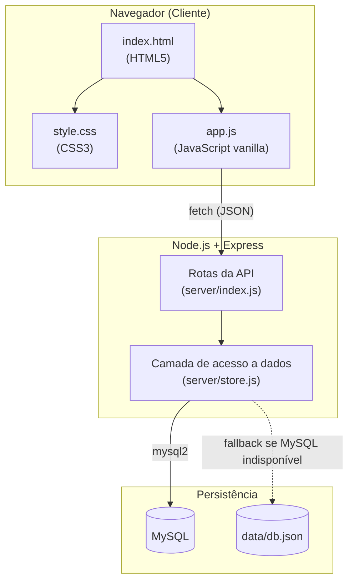
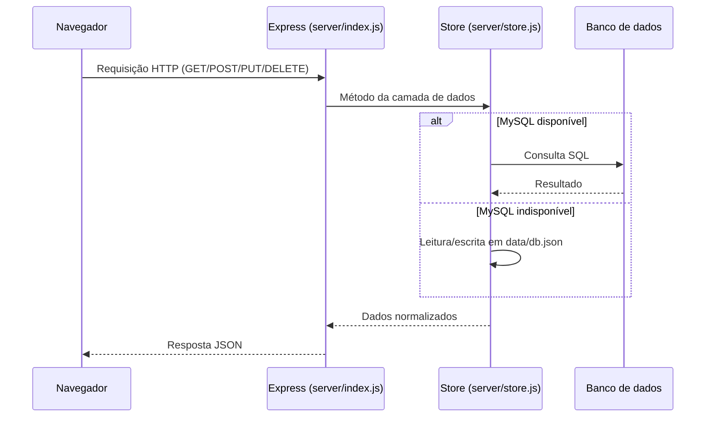
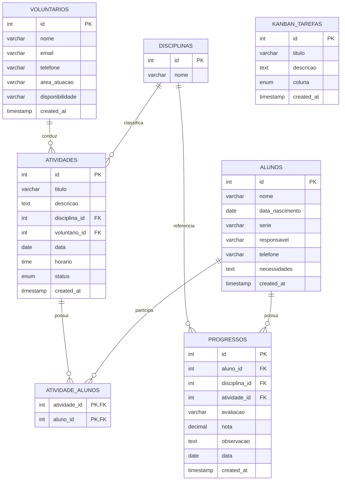
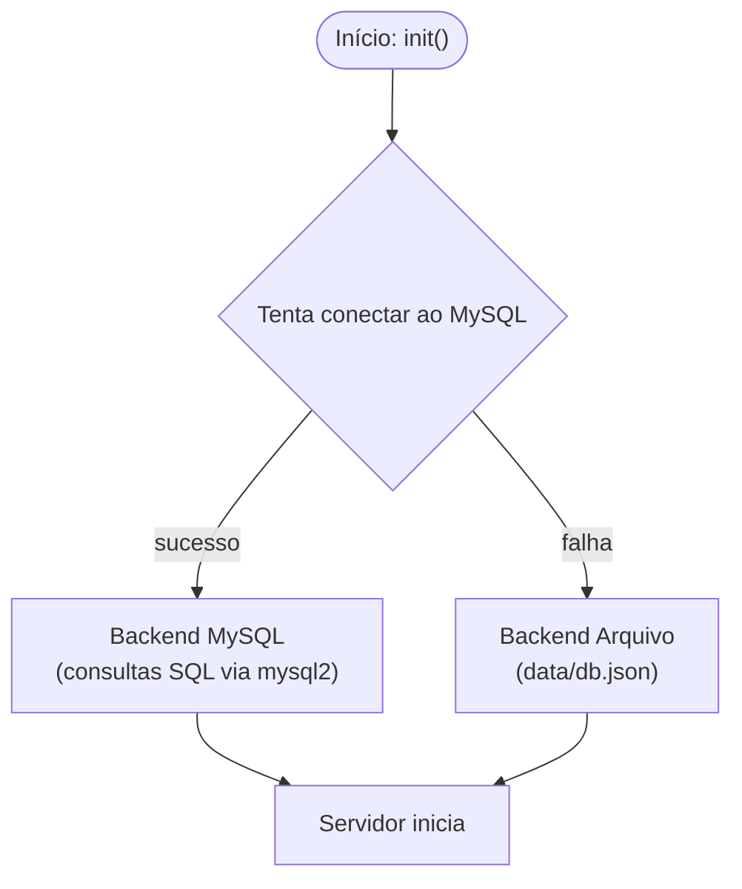
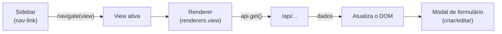
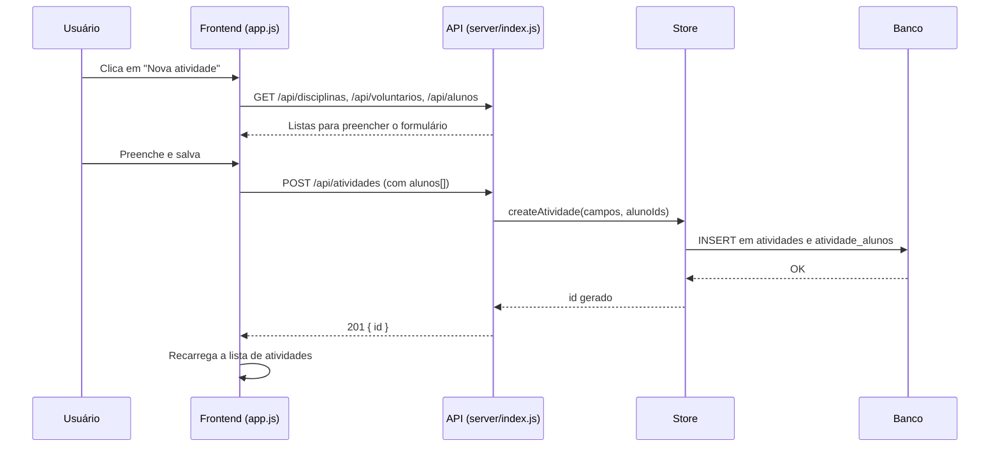
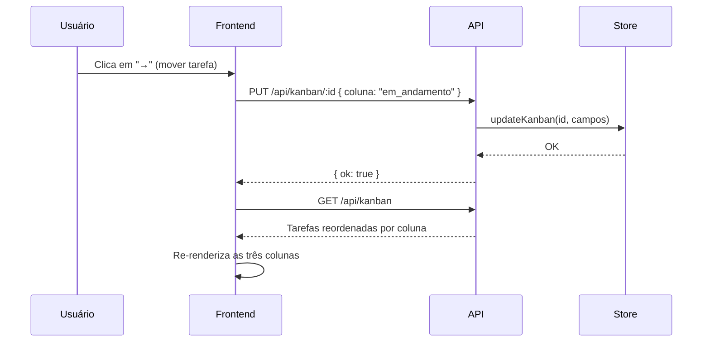

# Plataforma Web de Reforço Escolar — Bairro Uruguai

> **Trabalho Final — Atividades Extensionistas** · CST em Análise e Desenvolvimento
> de Sistemas (UNINTER)
>
> **Projeto:** *Plataforma Web de Reforço Escolar e Capacitação de Voluntários para
> a Comunidade* — Associação de Moradores do Bairro Uruguai, Teresina/PI.
>
> **Objetivo de Desenvolvimento Sustentável:** ODS 04 — Educação de Qualidade.

Aplicação web full-stack para apoiar o **reforço escolar de crianças e adolescentes
em contraturno**, permitindo o cadastro de alunos, a gestão de voluntários, a
organização de atividades pedagógicas, o acompanhamento individual do progresso e a
gestão do próprio projeto por meio de um **quadro Kanban**.

---

## Índice

1. [Visão geral](#visão-geral)
2. [Funcionalidades](#funcionalidades)
3. [Arquitetura](#arquitetura)
4. [Pilha tecnológica](#pilha-tecnológica)
5. [Estrutura do projeto](#estrutura-do-projeto)
6. [Banco de dados](#banco-de-dados)
7. [Camada de armazenamento (MySQL + fallback)](#camada-de-armazenamento)
8. [Backend — API REST](#backend--api-rest)
9. [Frontend — SPA](#frontend--spa)
10. [Fluxos principais](#fluxos-principais)
11. [Como executar](#como-executar)
12. [Variáveis de ambiente](#variáveis-de-ambiente)
13. [Implantação](#implantação)

---

## Visão geral

A associação atende crianças e adolescentes em horário oposto ao da escola e dispõe
de espaços subutilizados por falta de uma ferramenta de apoio pedagógico e de
capacitação de voluntários. Esta plataforma preenche essa lacuna, concentrando em um
único lugar:

- o **cadastro** de alunos, responsáveis e voluntários;
- a **organização** de aulas e oficinas (atividades de reforço);
- o **acompanhamento** da evolução de cada aluno (notas e observações);
- a **gestão ágil** do projeto com um quadro Kanban.

## Funcionalidades

| Módulo | Descrição |
| ------ | --------- |
| 🏠 **Dashboard** | Indicadores gerais (totais, média de notas) e resumo do Kanban. |
| 🎒 **Alunos** | CRUD de alunos com dados de série, responsável, contato e necessidades. |
| 🙋 **Voluntários** | CRUD de voluntários com área de atuação e disponibilidade. |
| 📅 **Atividades** | CRUD de aulas/oficinas vinculando disciplina, voluntário e alunos participantes. |
| 📈 **Progresso** | Registro de avaliações, notas e observações por aluno. |
| 🗂️ **Kanban** | Quadro com colunas *A fazer / Em andamento / Concluído*. |

---

## Arquitetura

A aplicação segue o modelo **cliente–servidor** em três camadas: um front-end estático
(SPA), uma API REST em Node.js e uma camada de persistência que funciona com **MySQL**
e, na ausência deste, com um **armazenamento local em arquivo** (fallback automático).



O fluxo de requisição é o seguinte:



## Pilha tecnológica

| Camada | Tecnologia | Observação |
| ------ | ---------- | ---------- |
| Front-end | HTML5, CSS3, JavaScript (vanilla) | Sem frameworks, conforme a proposta. |
| Back-end | Node.js + Express 4 | API REST em JSON. |
| Banco de dados | MySQL 8 (via `mysql2`) | Com fallback para arquivo JSON. |
| Infraestrutura | Docker / Docker Compose | Subida opcional de MySQL + aplicação. |

---

## Estrutura do projeto

```
reforco-escolar/
├── server/
│   ├── index.js          # Aplicação Express + definição das rotas da API
│   └── store.js          # Camada de dados (MySQL) com fallback para arquivo
├── database/
│   ├── schema.sql        # Criação do banco e das tabelas
│   └── seed.sql          # Dados de exemplo (seed)
├── public/
│   ├── index.html        # Página única (SPA) e estrutura das views
│   ├── css/style.css     # Estilos e componentes visuais
│   └── js/app.js         # Lógica do front-end (fetch, render, modal)
├── data/
│   └── db.json           # (gerado) persistência usada no modo fallback
├── Dockerfile
├── docker-compose.yml
├── .env.example
├── package.json
└── README.md
```

---

## Banco de dados

### Modelo relacional



### Descrição das tabelas

| Tabela | Propósito |
| ------ | --------- |
| `alunos` | Crianças e adolescentes atendidos em contraturno. |
| `voluntarios` | Equipe de apoio pedagógico (área de atuação e disponibilidade). |
| `disciplinas` | Matérias ofertadas (Matemática, Português, Inglês…). |
| `atividades` | Aulas/oficinas com status `planejada`, `em_andamento` ou `concluida`. |
| `atividade_alunos` | Tabela associativa (N:N) entre atividades e alunos. |
| `progressos` | Avaliações e notas por aluno, disciplina e atividade. |
| `kanban_tarefas` | Tarefas do projeto com coluna `a_fazer`, `em_andamento` ou `concluido`. |

> O script `database/schema.sql` cria as tabelas; `database/seed.sql` insere dados de
> exemplo (5 alunos, 4 voluntários, 6 disciplinas, 4 atividades, 3 progressos e 6
> tarefas no Kanban).

---

## Camada de armazenamento

O módulo `server/store.js` abstrai toda a persistência. No momento da inicialização,
ele **tenta conectar ao MySQL** (com um timeout curto) e, se a conexão falhar, ativa
automaticamente o modo **arquivo**:



Ambos os backends expõem a **mesma interface** (`getAlunos`, `createAluno`,
`getAtividades`, `getDashboard`, etc.), portanto as rotas do Express não precisam saber
qual mecanismo de persistência está em uso. Isso garante que o projeto **rode em
qualquer ambiente** — com ou sem banco de dados instalado.

---

## Backend — API REST

A API responde em JSON e segue convenções REST. As rotas estão definidas em
`server/index.js`.

### Endpoints

| Método | Rota | Descrição |
| ------ | ---- | --------- |
| GET | `/api/alunos` | Lista todos os alunos (ordenados por nome). |
| POST | `/api/alunos` | Cadastra um aluno. |
| PUT | `/api/alunos/:id` | Atualiza um aluno. |
| DELETE | `/api/alunos/:id` | Exclui um aluno (e seus progressos). |
| GET | `/api/voluntarios` | Lista todos os voluntários. |
| POST | `/api/voluntarios` | Cadastra um voluntário. |
| PUT | `/api/voluntarios/:id` | Atualiza um voluntário. |
| DELETE | `/api/voluntarios/:id` | Exclui um voluntário. |
| GET | `/api/disciplinas` | Lista as disciplinas. |
| POST | `/api/disciplinas` | Cadastra uma disciplina. |
| GET | `/api/atividades` | Lista atividades (com disciplina, voluntário e alunos). |
| POST | `/api/atividades` | Cadastra uma atividade e seus alunos. |
| PUT | `/api/atividades/:id` | Atualiza uma atividade e seus alunos. |
| DELETE | `/api/atividades/:id` | Exclui uma atividade. |
| GET | `/api/progressos?aluno_id=` | Lista progressos (filtro opcional por aluno). |
| POST | `/api/progressos` | Cadastra um registro de progresso. |
| DELETE | `/api/progressos/:id` | Exclui um registro de progresso. |
| GET | `/api/kanban` | Lista as tarefas do Kanban. |
| POST | `/api/kanban` | Cadastra uma tarefa. |
| PUT | `/api/kanban/:id` | Move/edita uma tarefa (muda a coluna). |
| DELETE | `/api/kanban/:id` | Exclui uma tarefa. |
| GET | `/api/dashboard` | Retorna os indicadores gerais. |

### Exemplos

**Criar aluno** — `POST /api/alunos`

```json
{
  "nome": "Ana Beatriz Sousa",
  "data_nascimento": "2012-04-15",
  "serie": "6º ano",
  "responsavel": "Maria Sousa",
  "telefone": "(86) 99911-2233",
  "necessidades": "Dificuldade em operações com frações."
}
```

**Criar atividade** — `POST /api/atividades` (o campo `alunos` é um array de IDs)

```json
{
  "titulo": "Aula de frações",
  "descricao": "Revisão de frações e exercícios em grupo.",
  "disciplina_id": 1,
  "voluntario_id": 1,
  "data": "2026-09-16",
  "horario": "14:00",
  "status": "planejada",
  "alunos": [1, 4]
}
```

**Dashboard** — `GET /api/dashboard`

```json
{
  "alunos": 5,
  "voluntarios": 4,
  "atividades": 4,
  "progressos": 3,
  "media_notas": 7.2,
  "kanban": [
    { "coluna": "a_fazer", "qtd": 2 },
    { "coluna": "em_andamento", "qtd": 2 },
    { "coluna": "concluido", "qtd": 2 }
  ]
}
```

---

## Frontend — SPA

A interface é uma *Single Page Application* sem frameworks. O arquivo `public/index.html`
contém uma sidebar de navegação e seis `<section>` (views). O `public/js/app.js`
controla o roteamento, renderização e comunicação com a API.



### Views

| View | Renderer | Interações |
| ---- | -------- | ---------- |
| `dashboard` | `renderers.dashboard` | Somente leitura; carrega `/api/dashboard`. |
| `alunos` | `renderers.alunos` | CRUD via modal (`alunoForm`). |
| `voluntarios` | `renderers.voluntarios` | CRUD via modal (`volForm`). |
| `atividades` | `renderers.atividades` | CRUD com seleção múltipla de alunos (`atvForm`). |
| `progressos` | `renderers.progressos` | Cadastro e exclusão de registros (`progForm`). |
| `kanban` | `renderers.kanban` | Criação, edição e movimentação de tarefas entre colunas. |

---

## Fluxos principais

### Cadastro de uma atividade de reforço



### Movimentação de tarefa no Kanban



---

## Como executar

### Opção 1 — Docker Compose

> Requer Docker com o plugin `compose` (`docker compose`). Em versões antigas, use
> `docker-compose up --build` (com hífen).

```bash
docker compose up --build
```

O Compose sobe o MySQL (com `schema.sql` e `seed.sql` aplicados automaticamente) e a
aplicação. Acesse <http://localhost:3000>.

### Opção 2 — Local com MySQL

```bash
npm install
cp .env.example .env        # edite as credenciais do banco
mysql -u root -p < database/schema.sql
mysql -u root -p < database/seed.sql
npm start
```

### Opção 3 — Local sem MySQL (modo fallback)

Não é necessário instalar nada além do Node.js:

```bash
npm install
npm start
```

Ao iniciar, o `store.js` detecta que não há MySQL e passa a persistir os dados em
`data/db.json` (com os mesmos dados de exemplo). O servidor imprime no console qual
backend está ativo:

```
[store] Conectado ao MySQL.
# ou
[store] MySQL indisponível (ECONNREFUSED). Usando armazenamento local em data/db.json.
```

---

## Variáveis de ambiente

Crie um arquivo `.env` (a partir de `.env.example`) para configurar a aplicação:

| Variável | Padrão | Descrição |
| -------- | ------ | --------- |
| `PORT` | `3000` | Porta do servidor web. |
| `DB_HOST` | `localhost` | Host do MySQL. |
| `DB_PORT` | `3306` | Porta do MySQL. |
| `DB_USER` | `root` | Usuário do MySQL. |
| `DB_PASSWORD` | *(vazio)* | Senha do MySQL. |
| `DB_NAME` | `reforco_escolar` | Nome do banco de dados. |

---

## Implantação

- **Produção com banco:** defina as variáveis de ambiente apontando para um MySQL
  real e execute `npm start` (idealmente sob um gerenciador de processos como `pm2`).
- **Contêineres:** `docker compose up --build -d` sobe a aplicação e o banco.
- **Persistência:** o volume `reforco_data` (definido no `docker-compose.yml`)
  preserva os dados do MySQL entre reinicializações.
